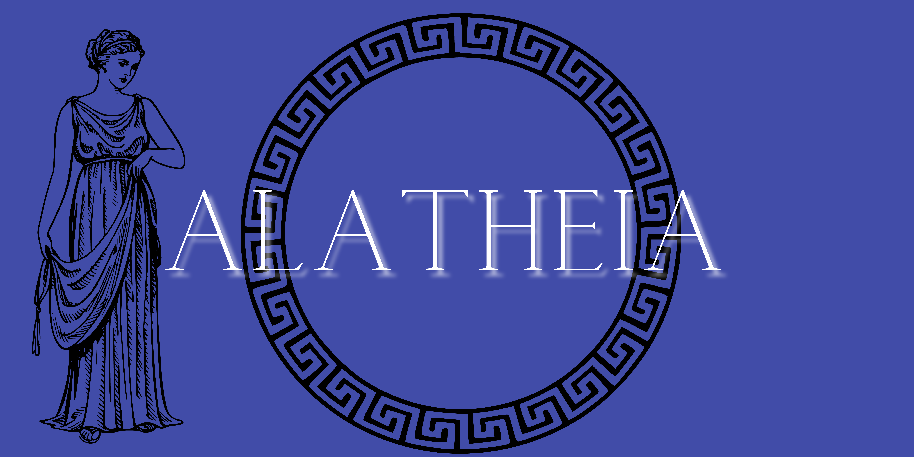

# Project Aletheia

## About
* `Aletheia`, the Greek goddess of Veritas, truthfulness, is the spirit of sincerity, disclosure, being unconcealed.
* `Project Aletheia` is the capstone project for `Data Science` course. 
* In this project I plan to use `Machine Learning` and `Exploratory Data Analysis` to understand if a given news source is neutral or biased towards particular political party or agenda.

## Plan 
* In order to do that I plan to,
     * Scrap data from one or more new websites. This data should have (but not limited to) content of news alticles, author, publication date and time. 
     * Use `NLP` algorithms to automatically label the topics in each news articles. 
     * Perform `Exploratory Data Analysis` on the labeled data to identify different patterns in the topics.

## Documentation
[Project Aletheia Google Doc](https://docs.google.com/document/d/1FdEUnRAybk2Olt4HoLDGiY-lGhw5Kzu0GtD2YsntysU/edit?usp=sharing)
